# Agentic Coding Development Toolkit

> **Thesis:** build **AI developer workflows**—the system that builds the system—instead of treating one feedback loop as the whole engineering discipline.

The source argues that reliable agentic engineering combines three actors at the right place and time: **engineers** supply intent and judgment, **agents** supply adaptive compute, and **deterministic code** supplies fast, repeatable control. The integrated map below follows that idea from a prompt-and-review primitive through validation loops, isolated parallel execution, organizational intake, specialized incident response, and a routed software factory.

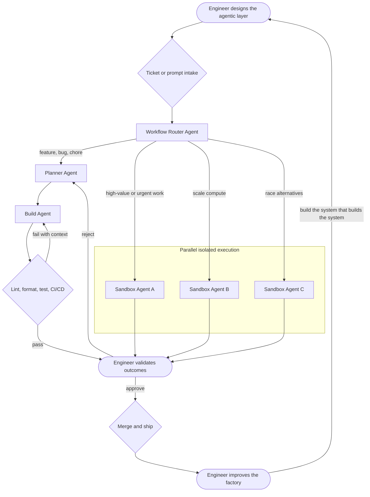

## Visual legend

- **Humans — rounded nodes:** `(["Engineer Review"])`
- **Agents — rectangles:** `["Build Agent"]`
- **Deterministic code and conditions — diamonds:** `{"Lint Code"}`
- **Worktrees and sandboxes — labeled `subgraph` containers**
- **Control and feedback — labeled edges:** `-->|pass|`, `-->|fail|`, `-->|approve|`, and `-->|reject|`
- Neutral conceptual labels may use a separately styled rectangle, but every operational node follows the shape language above.

## Sources and timestamp method

- [Source video: “It’s Time To Talk About Loop Engineering”](https://www.youtube.com/watch?v=VQy50fuxI34)
- [Timestamped transcript](./VQy50fuxI34_transcript.txt)

The supplied PNGs were cropped captures and did not show player controls. Their filenames are therefore listed only as **capture filenames**, not video timestamps. Each **representative video position** below is the nearest frame match recovered from source-video pixels and cursor placement, then checked against the adjacent transcript range. The PNG files are not included in this repository.

## Phase 1 — Actors of value creation

### S01 — Engineers, agents, and code

- **Capture filename:** `截圖 2026-07-23 下午3.37.40.png`
- **Frame-matched representative video position:** **03:51**
- **Supporting transcript range:** **03:37–04:44**
- **Conceptual takeaway:** Agentic engineering is the deliberate composition of engineers, agents, and deterministic code. Code is the most predictable and least expensive actor; agents add adaptive compute; engineers supply intent and judgment.

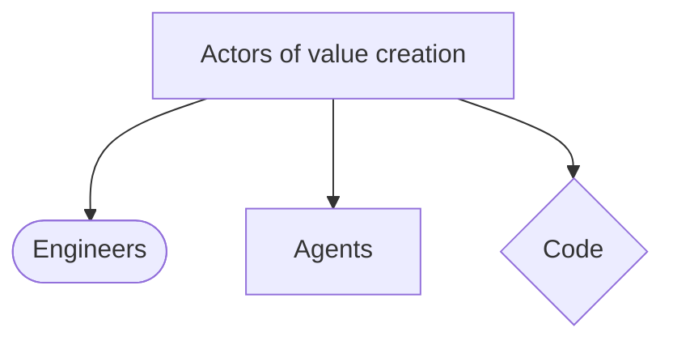

## Phase 2 — Progressive workflow ladder

### S02 — The primitive human-model-human workflow

- **Capture filename:** `截圖 2026-07-23 下午3.38.05.png`
- **Frame-matched representative video position:** **05:03**
- **Supporting transcript range:** **04:50–05:03**
- **Conceptual takeaway:** Every later workflow grows from a simple primitive: an engineer supplies intent, a model performs work, and an engineer reviews the result.

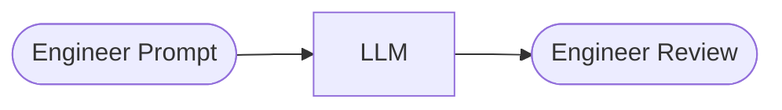

### S03 — The first deterministic validation loop

- **Capture filename:** `截圖 2026-07-23 下午3.38.22.png`
- **Frame-matched representative video position:** **05:56**
- **Supporting transcript range:** **05:20–05:56**
- **Conceptual takeaway:** Put deterministic linting outside the agent. Pass its failure context back into the same build workflow; only a pass reaches human review.

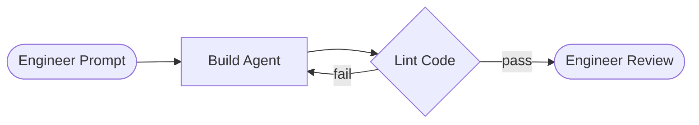

### S04 — Layer linting and formatting

- **Capture filename:** `截圖 2026-07-23 下午3.38.29.png`
- **Frame-matched representative video position:** **06:14**
- **Supporting transcript range:** **05:59–06:48**
- **Conceptual takeaway:** Add deterministic checks incrementally. Lint and format failures both return structured context to the build agent; human attention remains at the boundary.

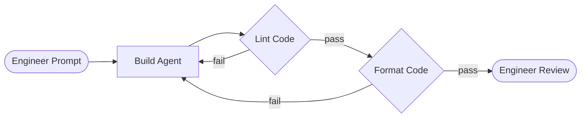

### S05 — Complete deterministic validation stack

- **Capture filename:** `截圖 2026-07-23 下午3.38.34.png`
- **Frame-matched representative video position:** **07:13**
- **Supporting transcript range:** **06:50–07:26**
- **Conceptual takeaway:** Lint, formatting, and tests form a repeatable validation pipeline. Every failure returns to Build; the engineer appears at planning and final validation rather than every internal step.

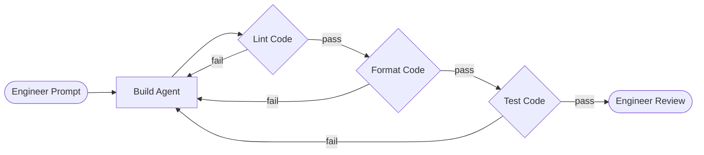

### S06 — Delegate validation to a test agent

- **Capture filename:** `截圖 2026-07-23 下午3.38.45.png`
- **Frame-matched representative video position:** **08:16**
- **Supporting transcript range:** **07:40–08:22**
- **Conceptual takeaway:** A test agent can orchestrate validation and return failures to Build. Review remains a human gate, and rejection also re-enters Build before shipping.

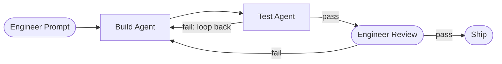

### S07 — Separate planning, building, and testing

- **Capture filename:** `截圖 2026-07-23 下午3.38.52.png`
- **Frame-matched representative video position:** **08:29**
- **Supporting transcript range:** **08:23–09:07**
- **Conceptual takeaway:** The familiar SDLC becomes an AI developer workflow: plan, build, test, review, and ship. Separating agent contexts makes each responsibility inspectable and replaceable.

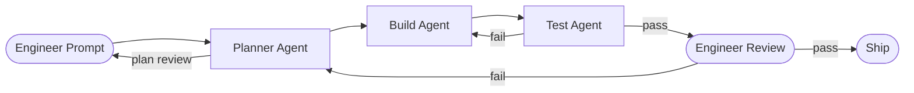

## Phase 3 — Parallel isolation

### S08 — Parallel worktree workflows

- **Capture filename:** `截圖 2026-07-23 下午3.38.58.png`
- **Frame-matched representative video position:** **09:11**
- **Supporting transcript range:** **09:08–10:37**
- **Conceptual takeaway:** Deterministic code creates isolated worktrees so several planner-build-test-review pipelines can execute in parallel without colliding, then converge at merge.

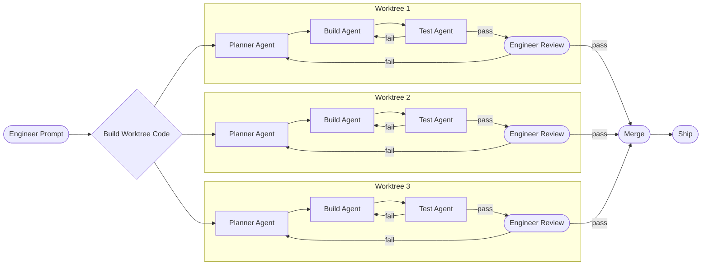

### S09 — Upgrade worktrees to agent sandboxes

- **Capture filename:** `截圖 2026-07-23 下午3.39.14.png`
- **Frame-matched representative video position:** **11:54**
- **Supporting transcript range:** **10:41–11:58**
- **Conceptual takeaway:** Give each branch a complete computer-like sandbox. Full isolation lets agents run applications and tests while engineers can enter the environment to inspect results before merge.

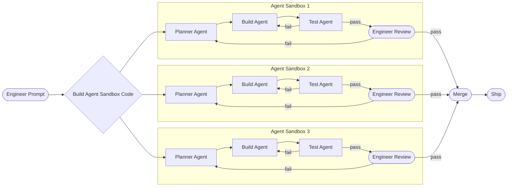

## Phase 4 — Organizational intake and full pipeline

### S10 — Turn organizational demand into planning context

- **Capture filename:** `截圖 2026-07-23 下午3.39.24.png`
- **Frame-matched representative video position:** **12:23**
- **Supporting transcript range:** **12:02–14:07**
- **Conceptual takeaway:** Support, product, and engineering feed one ticket system. A normal path uses an engineer to translate the ticket; advanced teams can route well-formed tickets directly into planning, scouting, and plan generation.

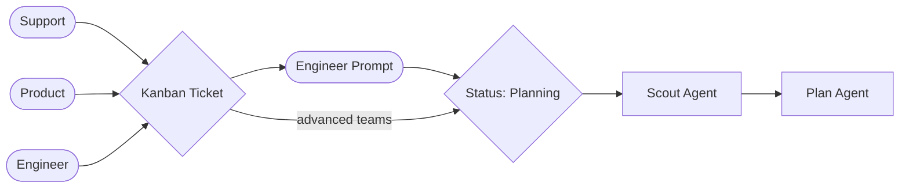

### S11 — Full ticket-to-production workflow

- **Capture filename:** `截圖 2026-07-23 下午3.39.32.png`
- **Frame-matched representative video position:** **13:03**
- **Supporting transcript range:** **13:03–15:15**
- **Conceptual takeaway:** Ticket status changes are deterministic control nodes around specialized Scout, Plan, Build, and Test agents. Test and CI/CD failures return to Build; successful delivery still passes through engineering review.

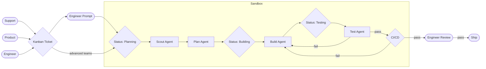

## Phase 5 — Hotfix race

### S12 — Production-crash response with racing sandboxes

- **Capture filename:** `截圖 2026-07-23 下午3.39.54.png`
- **Frame-matched representative video position:** **17:46**
- **Supporting transcript range:** **15:21–17:46**
- **Conceptual takeaway:** A specialized hotfix agent optimizes for restoration speed. A human approval gate protects the high-risk transition, after which several isolated sandboxes race; the first validated result can ship.

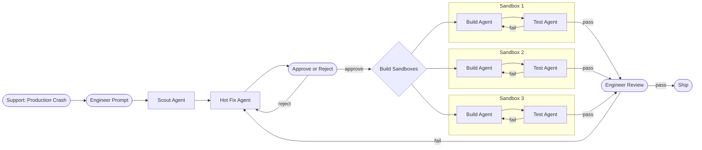

## Phase 6 — Routed software factory

### S13 — Route each ticket to the right specialized workflow

- **Capture filename:** `截圖 2026-07-23 下午3.40.02.png`
- **Frame-matched representative video position:** **21:51**
- **Supporting transcript range:** **19:11–23:44**
- **Conceptual takeaway:** A software factory classifies work and selects a workflow whose cost, model quality, isolation, controls, and human gates fit the job. Hotfixes, features, bugs, chores, and custom ADWs converge at merge and ship.

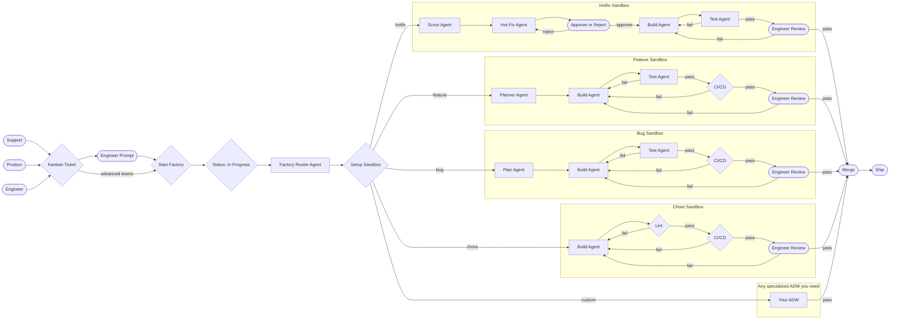

## Operating playbook from the transcript

1. **Start simple.** Begin with the smallest workflow that solves a real problem: one build agent followed by one external deterministic check.
2. **Separate agents from code.** A skill that internally invokes every tool is still one opaque agent. Production workflows need explicit boundaries between adaptive agent work and deterministic execution.
3. **Walk the workflow manually first.** Perform every node, path, condition, review, and production transition yourself before encoding the orchestration.
4. **Specialize only after proof.** Split planner, scout, frontend, backend, test, or hotfix agents when observed workload and failure modes justify narrower context.
5. **Keep context and information flows explicit.** Store and pass results between steps deliberately, including failures, session identity, tickets, plans, test evidence, and review decisions.
6. **Balance agents with deterministic code.** Use agents where interpretation is valuable; use code where speed, reliability, repeatability, and zero-token execution are available.
7. **Retain classic modular and testable engineering.** Prefer isolated, decoupled nodes with single interfaces. Test planning, building, status updates, validation, failure routing, and shipping independently.
8. **Optimize the right work at the right performance, price, and speed.** A chore may need one lightweight workhorse; a production incident may justify state-of-the-art planning and many racing sandboxes.
9. **Keep engineers on the compounding layer.** Human effort is most leveraged in workflow design, guardrails, planning, and validation—the agentic layer that improves every future execution.

## Screenshot coverage matrix

| ID | Capture filename | Representative video position | Transcript range | Conceptual phase | Represented |
|---|---|---:|---:|---|---|
| S01 | `截圖 2026-07-23 下午3.37.40.png` | 03:51 | 03:37–04:44 | Actors | Yes |
| S02 | `截圖 2026-07-23 下午3.38.05.png` | 05:03 | 04:50–05:03 | Progressive workflow ladder | Yes |
| S03 | `截圖 2026-07-23 下午3.38.22.png` | 05:56 | 05:20–05:56 | Progressive workflow ladder | Yes |
| S04 | `截圖 2026-07-23 下午3.38.29.png` | 06:14 | 05:59–06:48 | Progressive workflow ladder | Yes |
| S05 | `截圖 2026-07-23 下午3.38.34.png` | 07:13 | 06:50–07:26 | Progressive workflow ladder | Yes |
| S06 | `截圖 2026-07-23 下午3.38.45.png` | 08:16 | 07:40–08:22 | Progressive workflow ladder | Yes |
| S07 | `截圖 2026-07-23 下午3.38.52.png` | 08:29 | 08:23–09:07 | Progressive workflow ladder | Yes |
| S08 | `截圖 2026-07-23 下午3.38.58.png` | 09:11 | 09:08–10:37 | Parallel isolation | Yes |
| S09 | `截圖 2026-07-23 下午3.39.14.png` | 11:54 | 10:41–11:58 | Parallel isolation | Yes |
| S10 | `截圖 2026-07-23 下午3.39.24.png` | 12:23 | 12:02–14:07 | Organizational intake | Yes |
| S11 | `截圖 2026-07-23 下午3.39.32.png` | 13:03 | 13:03–15:15 | Full organizational pipeline | Yes |
| S12 | `截圖 2026-07-23 下午3.39.54.png` | 17:46 | 15:21–17:46 | Hotfix race | Yes |
| S13 | `截圖 2026-07-23 下午3.40.02.png` | 21:51 | 19:11–23:44 | Routed software factory | Yes |

**Coverage: 13 of 13 supplied screenshots represented; no screenshot PNGs uploaded.**
