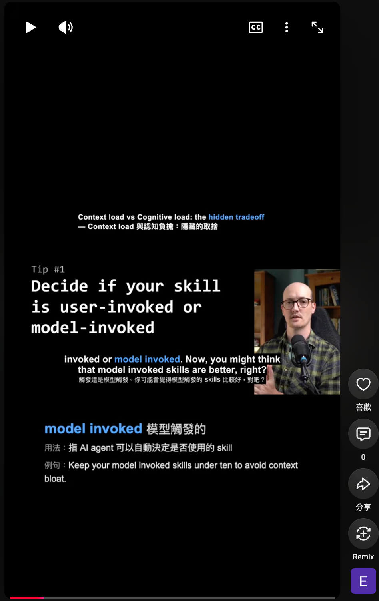

# Video Language Learning

**Turn any English video into language learning material — auto-generated bilingual subtitles + vocabulary cards.**

Give an AI agent a YouTube URL, and it will:
1. Transcribe the audio and translate it
2. Pick out phrases and patterns worth learning
3. Produce a ready-to-post Reels/Shorts learning video

No video editing experience required. No manual subtitling.



▶️ More examples: [@EnglishLearning-td2hr](https://www.youtube.com/@EnglishLearning-td2hr)

---

## What You Get

| Element | Description |
|---------|-------------|
| **Bilingual subtitles** | Original English + translated Chinese, perfectly synced to speech |
| **Keyword highlighting** | Words worth learning are color-highlighted in the subtitle |
| **Vocabulary cards** | Each keyword comes with explanation, usage, and example sentence, appearing in sync with the video |
| **Hook title** | One-line summary at the top so viewers instantly know the topic |

Supports **landscape (16:9)** and **Reel/Shorts (9:16)** output formats.

---

## How It Works

```
YouTube URL
    │
    ▼
┌─────────────────────────────────────────┐
│  1. Download video                       │  yt-dlp
│  2. Speech-to-text (hallucination-free)  │  mlx-whisper
│  3. Find learning-worthy segments        │  AI analysis
│  4. Translate + select vocabulary        │  AI translation
│  5. Generate subtitles, cards, hook      │  Python + Playwright
│  6. Compose final video                  │  ffmpeg
└─────────────────────────────────────────┘
    │
    ▼
  Finished learning video (ready to upload)
```

**From a YouTube URL to a finished video — fully automated by an AI agent.**

---

## Usage

1. Clone this repo
2. Feed `SKILL.md` to your AI coding agent (Claude, GPT, Cursor, etc.)
3. Tell it: "Turn this video into a learning video" + paste a YouTube URL
4. The AI handles everything — installs dependencies, transcribes, translates, composes

```bash
git clone <this-repo>
cd video-language-learning
npm install    # installs Playwright + Chromium
```

---

## Requirements

| Tool | Purpose | Install |
|------|---------|---------|
| macOS + Apple Silicon | mlx-whisper only runs here | — |
| ffmpeg (with libass) | Video compositing, subtitle burning | `brew install ffmpeg` |
| yt-dlp | Video download | `brew install yt-dlp` |
| Node.js 18+ | Card/hook rendering | `brew install node` |
| Python 3.9+ | Pipeline orchestration | Pre-installed on macOS |
| mlx-whisper | Speech recognition | `pip install mlx-whisper` |

---

## Technical Details

### Architecture

```
SKILL.md (AI operation manual)
    │
    │  AI agent handles: transcribe, translate, select vocab, generate input.json
    │
    ▼
┌──────────────────────────────────────────────┐
│  validate.py        Input format validation   │
│  gen_ass.py         ASS subtitles (bilingual + highlights) │
│  gen_cards.js       Vocabulary card PNGs (Playwright)      │
│  gen_hook.js        Hook title PNG                         │
│  compose.py         Landscape composition (one-shot)       │
│  compose_reel.py    Reel composition (9:16)                │
└──────────────────────────────────────────────┘
```

### Design Decision: Fixed Scripts vs AI-Generated Code

Having the AI dynamically generate rendering code each time (e.g., writing ffmpeg commands or HTML templates on the fly) produces inconsistent results — it works this time, breaks next time.

This project **separates concerns**:
- **AI handles content**: translation, vocabulary selection, assembling input.json (judgment-based work AI excels at)
- **Scripts handle rendering**: read input.json, produce deterministic output (same input always produces the same video)

Benefits:
1. **Deterministic** — AI only needs to "fill in the right data", not "write correct code". Debugging means checking input.json, not hunting bugs in dynamically generated code
2. **Token-efficient** — Rendering logic doesn't consume context window. AI only outputs structured JSON
3. **No corner-cutting** — AI under context window pressure tends to skip steps or simplify execution. Fixed scripts always run the full pipeline regardless of context length
4. **Programmatic validation** — `validate.py` checks input.json format correctness before rendering. More reliable than AI self-checking

### Hallucination-Free Transcription

Uses `condition_on_previous_text=False` to make each segment transcribe independently. Whisper tends to hallucinate on long audio (repeating sentences, generating phantom text). This parameter cuts cross-segment dependency, ensuring clean transcription per segment.

### Cross-Segment Highlighting

When a phrase spans two whisper segment boundaries (e.g., "reward centers" split across segments), `gen_ass.py` automatically detects this and highlights the corresponding portion in each segment. No manual handling needed.

### Vocabulary Selection Logic

Not random. Quantity scales with video length, mixed by type:

| Video Length | Cards |
|---|---|
| 30-60s | 5-7 |
| 1-2 min | 8-12 |
| 2-3 min | 12-15 |

- 30-40% phrases (phrasal verbs, discourse markers)
- 20-30% single words (high-frequency in native speech but rarely produced by learners)
- 30-40% sentence patterns (framing sentences, conditionals)

Selection criteria: words native speakers use frequently that learners understand but wouldn't actively produce.

### Reel Layout

```
┌──────────────────┐
│  [Hook - 648px]   │ ← top of video area
│                  │
│   Video (1080w)  │ ← vertically centered
│   [Subtitles]    │ ← burned into video
│                  │
├──────────────────┤
│  [Card - 900px]   │ ← bottom black area
└──────────────────┘
Output: 1080×1920
```

### Customization

Edit `style.json` to change:
- Subtitle fonts, sizes, highlight color, background opacity
- Card appearance (background, border radius, font sizes)
- Hook styling
- Output resolution and CRF compression

---

## File Structure

```
├── SKILL.md              ← AI agent operation manual (core)
├── README.md
├── compose.py            ← Landscape one-shot composition
├── compose_reel.py       ← Reel (9:16) composition
├── gen_ass.py            ← ASS subtitle generation
├── gen_cards.js          ← Vocabulary card PNG rendering
├── gen_hook.js           ← Hook title rendering
├── validate.py           ← input.json validation
├── style.json            ← Visual styling config
├── package.json
├── example/
│   └── input.example.json
└── demo.png
```

## License

MIT
