# AI 工程工作流程：從單一 Agent 到軟體工廠

這份文件不是在介紹一個更花俏的「AI 寫程式迴圈」，而是在說明我們要如何建立一套可重複、可驗證、可擴充的 **AI 開發工作流程（AI Developer Workflow，ADW）**。

核心觀念很簡單：工程師不再親手執行每一個步驟，而是把心力放在工作流程的設計、邊界與驗收。Agent 負責需要理解與推理的工作，確定性的程式碼負責快速且一致的檢查。三者組合起來，才會成為能長期運作的工程系統。

## 一張圖看懂整體做法

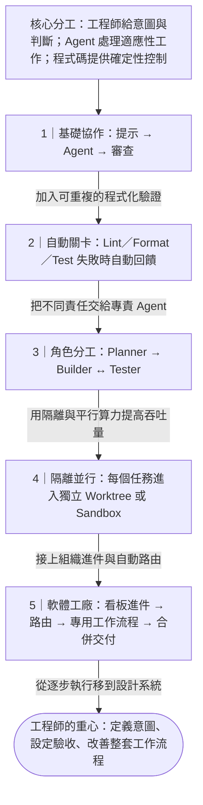

這張圖刻意只保留主幹。真正重要的不是圖上有多少個迴圈，而是：

1. 工程師在開始前把意圖講清楚，在結束前承擔驗收責任。
2. Agent 處理需要脈絡、判斷與生成能力的工作。
3. 可以用程式碼確定答案的地方，就不要浪費 Agent 的推理與 token。
4. 每一次失敗都要帶著可用的證據回到正確節點，而不是讓人重新描述問題。
5. 工作流程成熟後，工程師持續改善「生產軟體的系統」，而不是反覆手動救每一個任務。

## 三種價值創造者

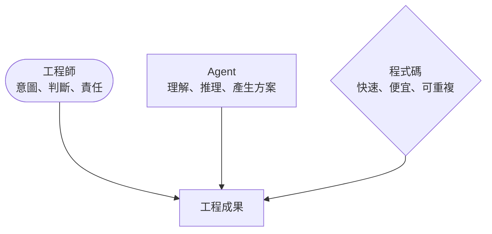

三者不是互相替代，而是各自放在最適合的位置。

| 角色 | 最適合負責 | 不應該被迫負責 |
|---|---|---|
| 工程師 | 定義意圖、決定邊界、評估風險、最終驗收 | 盯著每個 Agent 步驟、重複搬運狀態 |
| Agent | 探索程式庫、規劃、實作、分析失敗、提出候選方案 | 取代組織決策，或假裝確定未知事實 |
| 確定性程式碼 | Lint、格式化、型別檢查、測試、CI/CD、狀態更新 | 處理需要語意理解與模糊判斷的工作 |

## 從最小可行流程開始

最小的工作流程只有三個節點：工程師提出任務、Agent 執行、工程師審查。這也是後面所有複雜流程的基礎。

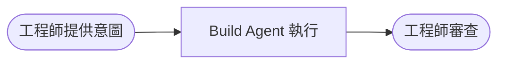

但如果每次錯誤都要等工程師親自發現，這套流程仍然只是「有人盯著 Agent 寫程式」。第一個實際升級，是把能自動判斷的品質門檻移到 Agent 外面。

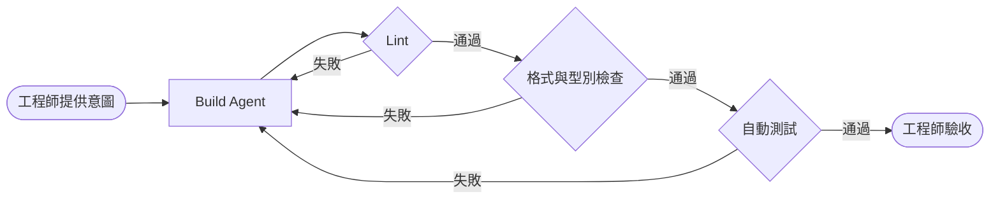

這裡有兩個實作重點：

- 檢查必須是工作流程中的獨立節點，而不是藏在一個龐大 Skill 裡。否則我們無法單獨測試、替換或觀察它。
- 失敗時要把完整結果、同一個工作階段 ID 與必要脈絡送回 Build Agent，讓它能在原本的工作上修正。

## 把責任拆給專門的 Agent

當驗證內容越來越複雜，可以讓 Test Agent 統籌測試策略、執行檢查並整理失敗證據。它不是取代確定性測試，而是負責選擇、組合與解讀測試。

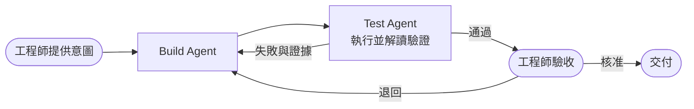

再往前一步，將規劃、建置與測試拆成不同 Agent。每個 Agent 只保留完成職責所需的脈絡，避免單一對話同時塞入需求探索、實作細節與測試紀錄。

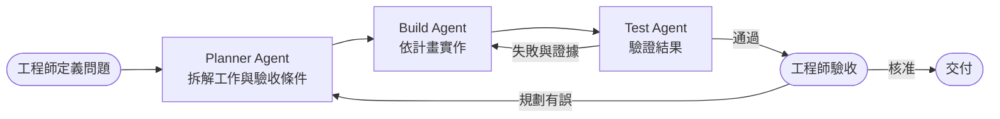

拆分 Agent 的目的不是讓圖變複雜，而是建立清楚的責任邊界。只有當實際工作量、脈絡衝突或錯誤型態證明有必要時，才新增專門角色。

## 用隔離換取安全的平行處理

當多個 Agent 同時修改同一份程式庫，它們會互相踩到檔案與狀態。工作樹（worktree）可以作為起點；需要執行完整應用、瀏覽器或系統測試時，則使用各自獨立的 Agent 沙盒。

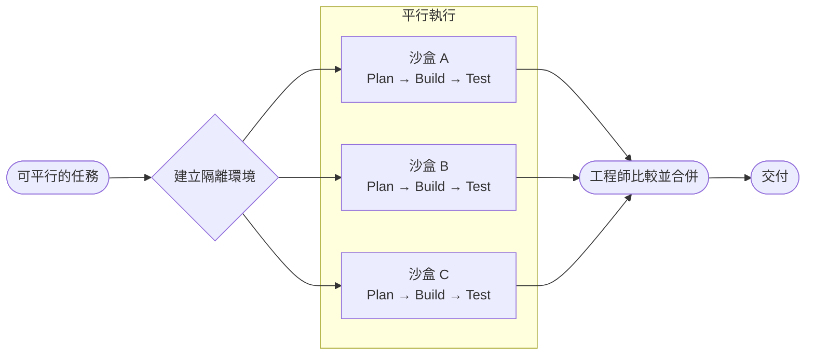

平行處理不是目的本身。只有在工作可以解耦、不同方案值得競爭，或時效價值高於額外算力成本時才使用。沙盒的價值則更普遍：它讓 Agent 可以自由執行程式，同時把錯誤限制在可丟棄的環境裡。

## 從組織需求進入工程流程

真正的工作不會從一個完美 prompt 開始。它通常來自客服、產品或工程師提交的 ticket。一般團隊仍需要工程師把 ticket 翻譯成可執行的意圖；只有當組織已能穩定寫出清楚的需求與驗收條件時，才適合直接啟動工作流程。

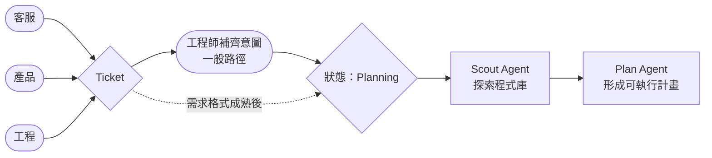

一個完整但仍容易理解的交付流程如下：

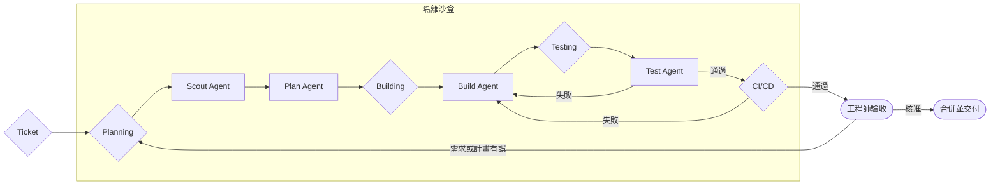

Ticket 狀態、計畫、測試證據、CI 結果與審查決策都應是可儲存、可傳遞的明確資訊。不要依賴某個 Agent「記得剛才發生什麼」。

## 生產事故：用競速換取復原速度

生產事故的最佳流程與一般功能開發不同。此時的目標是以最小、安全、可驗證的改動恢復服務，而不是順便重構或最佳化系統。Hotfix Agent 因此需要明確的專業記憶與限制。

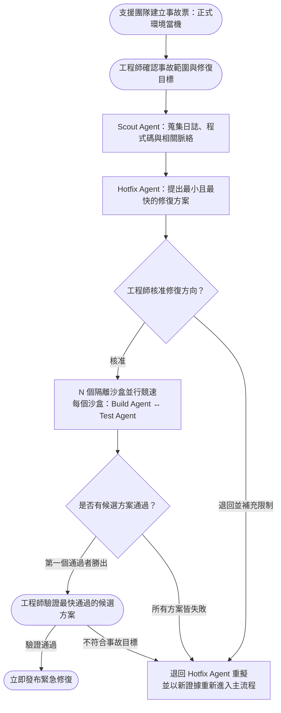

這裡保留兩個人工關卡：

1. **執行前核准**：確認修復方向、影響範圍與不可破壞的邊界。
2. **發布前驗證**：確認最快完成的候選方案真的解決事故，而且沒有引入不可接受的風險。

沙盒數量不是固定答案。簡單事故可能只需要一個；高損失、複雜事故則可以讓三個、五個或更多方案競速。工作流程要能依時間價值與算力預算調整。

## 軟體工廠：讓不同任務走不同流程

成熟系統不會用同一套昂貴流程處理所有 ticket。Router 先判斷任務類型、風險與時效，再選擇適合的 Agent、模型、驗證層級與沙盒數量。

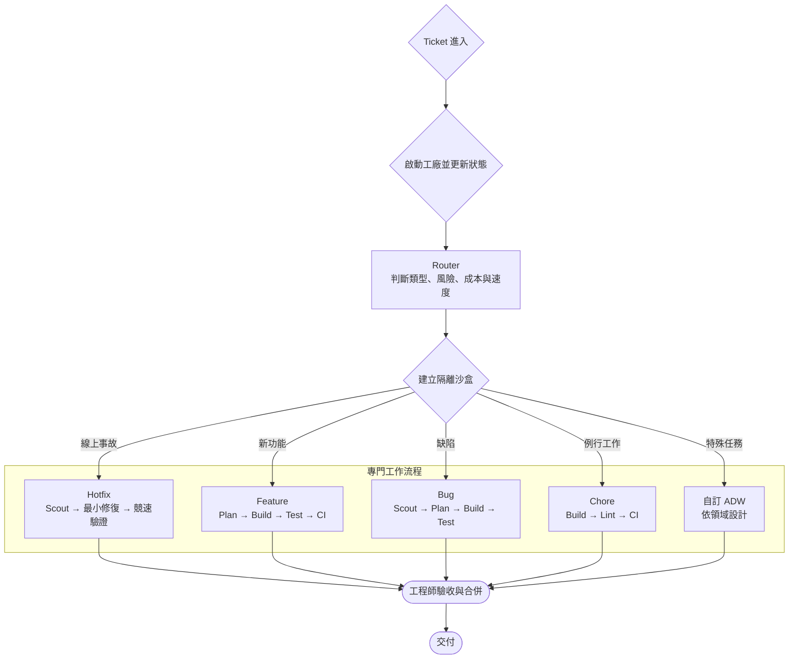

建議的預設配置：

| 任務 | 建議流程 | 取捨 |
|---|---|---|
| Chore | 輕量 Build Agent → Lint → CI → Review | 成本低、速度快，不需要重型規劃 |
| Bug | Scout → Plan → Build → Test → Review | 先理解根因，避免只修表面症狀 |
| Feature | Planner → Build → Test → CI → Review | 重視需求邊界、整合與回歸風險 |
| Hotfix | Scout → Hotfix 方案 → 人工核准 → 沙盒競速 → 人工發布 | 願意多花算力換取復原速度 |
| 特殊領域 | 專門 Agent、工具與 Evaluation | 把團隊經驗模板化，而非依賴通用 Agent |

## 我們要如何導入

影片提供的是工作流程骨架；團隊分享會則補上我們實際採用時的人類決策方式。兩者組合後，日常路徑如下：

1. **先把意圖講清楚。** 用五問法確認：這是誰的問題、完成後改變什麼、成功訊號是什麼、不做的代價是什麼，以及哪些東西不能破壞或刻意不做。意圖不清楚，就不啟動執行。
2. **先審 Planning，再審產品。** Scout 收集程式碼、文件與既有決策；Planner 把結果整理成可審查的計畫、Mental Map，以及必要的 Given-When-Then。人把主要力氣用在修正計畫，而不是事後逐個追 bug。
3. **在隔離沙盒中執行。** Builder 只拿到已確認的計畫，在獨立環境完成修改。需要平行處理時，每條路徑使用自己的沙盒，避免互相污染。
4. **用程式碼建立硬性關卡。** Lint、format、type check、test 與 CI/CD 都由確定性程式執行。每個失敗都必須帶著證據回到負責修正的 Agent。
5. **讓驗證保持獨立。** Test 或 Adversarial Agent 依 acceptance criteria 與 Evaluation 挑問題，不沿用 Builder 的完整思考脈絡，避免實作者替自己的結果合理化。
6. **人只處理高價值決策。** 工程師在開始時核准意圖與計畫，在最後檢查變更、測試證據、風險與實際結果；中間不需要一直盯著 Agent 執行。
7. **修復工作流程，而不只修復這次產出。** 每次失敗都要轉成更清楚的 intent、Evaluation、test、guardrail 或 routing rule，讓下一次執行自然變好。

### 建議導入順序

不要一開始就建造完整軟體工廠。選一個可重複、完成條件清楚的真實任務，親自走完每個節點與失敗路徑；接著加入一個 Agent 外部的確定性檢查，固定節點之間傳遞的 session、計畫、錯誤與測試證據。只有在實際 workload 或 failure mode 證明有必要時，才拆出專門 Agent、增加沙盒並行，最後再加入 Router 與多套工作流程。

工作流程本身也必須被當成產品測試。規劃、建置、狀態更新、失敗回傳、CI、審查與發布都應能單獨驗證與替換。

## 判斷是否做對了

一套好的 AI 開發工作流程應該讓我們回答以下問題：

- 任務為什麼選擇這條路徑？
- 每個 Agent 收到哪些脈絡，又產出哪些可檢查的成果？
- 哪些判斷是 Agent 做的，哪些結果由確定性程式碼保證？
- 失敗會帶著什麼證據回到哪一個節點？
- 人在哪裡核准，對什麼風險負責？
- 同一套流程重跑十次、百次，結果是否仍然穩定？
- 如果明天替換模型、工具或 Agent，邊界是否清楚到可以局部替換？

Agentic Engineering 不是「看不懂系統也讓 AI 繼續跑」。恰恰相反，它要求工程師把系統理解得夠清楚，清楚到能將自己的工程判斷模板化，讓工作流程在沒有持續盯場的情況下仍然可靠運作。

## 相關資料

- [來源影片：FORGET Loop Engineering. Agentic Engineering is about THIS](https://www.youtube.com/watch?v=VQy50fuxI34)
- [英文逐字稿](./VQy50fuxI34_transcript.txt)
- [繁體中文逐字稿](./VQy50fuxI34_transcript_zh-TW.md)
- [內部 AI 工程分享會整理](./AI-engineering-lesson.md)
